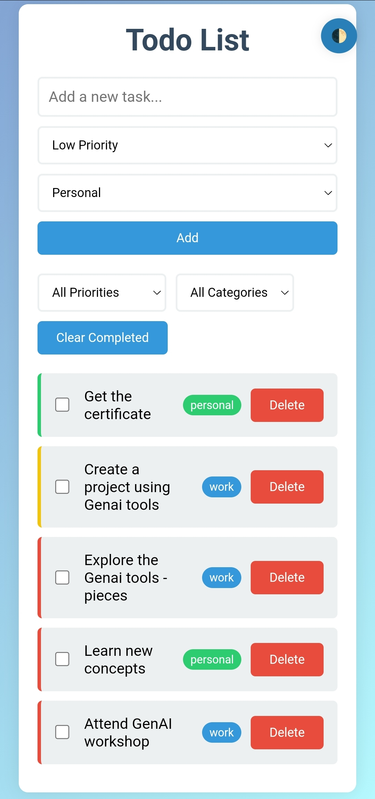

# **Todo List App**

An elegant and functional **Todo List Application** designed to simplify task management. With intuitive controls and categorization features, users can seamlessly organize, track, and manage their daily priorities.

---
**🚀 Try App 👉:** [Live Demo](https://itzdineshx.github.io/To-do-list.app/)
---

## **🌟 Features**
### 🎯 **Efficient Task Management**
- **Add Tasks**: Create tasks with customizable priorities (Low, Medium, High) and categories (Personal, Work, etc.).
- **Mark as Complete**: Keep track of your progress by marking tasks as completed.
- **Delete Tasks**: Remove unnecessary tasks with ease.

### 🔍 **Advanced Filtering**
- Filter tasks based on:
  - **Priority**: Low, Medium, or High.
  - **Category**: Personal, Work, etc.
- **Clear Completed**: Clean up completed tasks in a single click.

### 🎨 **Visual Indicators**
- Priority levels are **color-coded** for easy identification.
- Categories are tagged with unique styles for better task distinction.

---

## **🎨 UI Preview**
### Main Interface
  
*The app's sleek interface showcasing its core functionalities.*

---

## **📜 About the Project**
This project was created as part of the **GenAI 101 with Pieces FREE Certification** program, completed in just 1 day. The certification focuses on leveraging generative AI tools to build interactive and impactful applications.

---

## **📘 How to Use**
1. **Add Task**: Type your task in the input field, select the priority and category, and click `Add`.
2. **Filter Tasks**: Use the dropdown menus to filter tasks by priority and category.
3. **Mark as Complete**: Click the checkbox next to a task to mark it as complete.
4. **Delete Task**: Click the red `Delete` button to remove a task.
5. **Clear Completed**: Use the `Clear Completed` button to remove all completed tasks at once.

## **sample use case**

---

## **🤝 Contributing**
Contributions are always welcome! Follow these steps to contribute:  
1. Fork the repository.  
2. Create a feature branch: `git checkout -b feature-name`.  
3. Commit your changes: `git commit -m "Add some feature"`.  
4. Push the branch: `git push origin feature-name`.  
5. Open a pull request.

---

## **🛠️ Built With**
- **HTML5**: For structure and layout.  
- **CSS3**: For styling and visual aesthetics.  
- **JavaScript**: For functionality and interactivity.  

---

## **📧 Contact**
For questions, suggestions, or feedback, feel free to reach out via [GitHub Issues](https://github.com/yourusername/todo-list-app/issues).

---

## **Credits**
This application was generated with the support of **Claude AI**, showcasing the potential of generative AI in app development.

---

Feel free to modify and enhance this app to suit your personal or professional needs. Happy coding! 🎉
