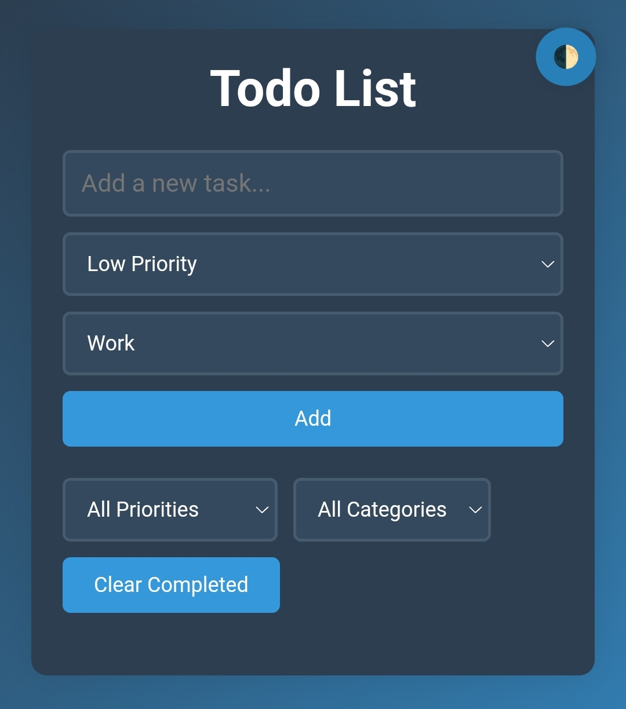

# **Todo List App**

An elegant and functional **Todo List Application** designed to simplify task management. With intuitive controls and categorization features, users can seamlessly organize, track, and manage their daily priorities.

---

## **🌟 Features**
### 🎯 **Efficient Task Management**
- **Add Tasks**: Create tasks with customizable priorities (Low, Medium, High) and categories (Personal, Work, etc.).
- **Mark as Complete**: Keep track of your progress by marking tasks as completed.
- **Delete Tasks**: Remove unnecessary tasks with ease.

### 🔍 **Advanced Filtering**
- Filter tasks based on:
  - **Priority**: Low, Medium, or High.
  - **Category**: Personal, Work, etc.
- **Clear Completed**: Clean up completed tasks in a single click.

### 🎨 **Visual Indicators**
- Priority levels are **color-coded** for easy identification.
- Categories are tagged with unique styles for better task distinction.

---

## **🎨 UI Preview**
### Main Interface

*The app's sleek interface showcasing its core functionalities.*

---

## **📜 About the Project**
This project is a part of the **GenAI 101 with Pieces FREE Certification** program, completed in 1 day. The certification focuses on leveraging generative AI tools for building interactive and impactful applications.

---

## **🛠️ How to Run Locally**
Follow these steps to get the project running on your local machine:

### 1️⃣ Clone the Repository
```bash
git clone https://github.com/yourusername/todo-list-app.git
cd todo-list-app
```

### 2️⃣ Install Dependencies
Make sure you have [Node.js](https://nodejs.org/) installed. Then, install the necessary dependencies:
```bash
npm install
```

### 3️⃣ Start the Application
Run the development server:
```bash
npm start
```

### 4️⃣ Open in Your Browser
The app will be live at `http://localhost:3000`.

---

## **🚀 Deployment**
You can deploy the application using platforms like:
- [Vercel](https://vercel.com/)  
- [Netlify](https://www.netlify.com/)

---

## **💻 Technologies Used**
- **Frontend**: React.js, CSS3
- **Backend**: Node.js (if applicable)
- **State Management**: Context API / Redux (if applicable)
- **Deployment**: Vercel / Netlify (optional)

---

## **🤝 Contributing**
Contributions are always welcome!  
1. Fork the repository.  
2. Create a feature branch: `git checkout -b feature-name`.  
3. Commit your changes: `git commit -m "Add some feature"`.  
4. Push the branch: `git push origin feature-name`.  
5. Open a pull request.

---

## **📧 Contact**
If you have any questions, suggestions, or feedback, feel free to reach out via [GitHub Issues](https://github.com/yourusername/todo-list-app/issues).

---
